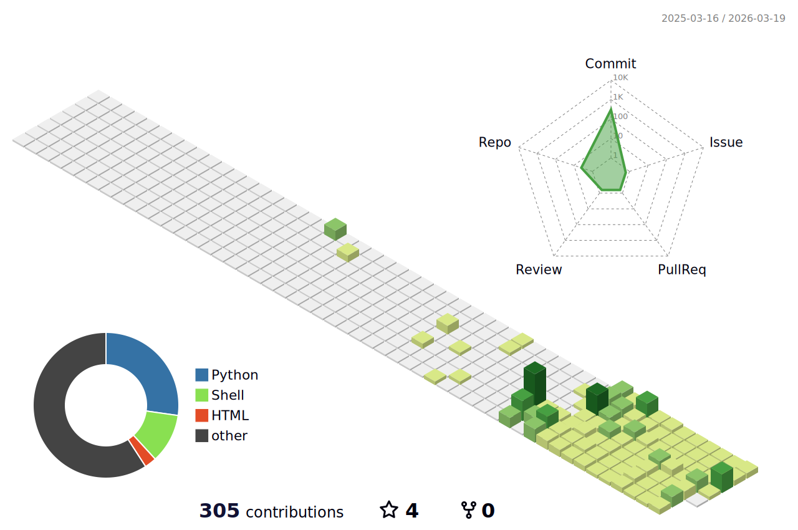

<h1 align="center">Hi 👋, I'm Manvendra Singh</h1>

  <b>B.Tech CSE | Python • AI/ML • Web Development</b>

  

---

## 📊 GitHub Overview

  

  

  

---

## 🔥 Contribution Streak

  

  

---

## 🛠️ Tech Stack

  

 

---

## 🧊 3D Contribution Graph

  

  

---

## 🐍 Contribution Snake

  

 

---

## 📫 Connect With Me

  
  &nbsp;&nbsp;&nbsp;
  

---

<h3 align="center">⭐ Keep Building • Keep Learning • Stay Consistent ⭐</h3> 

